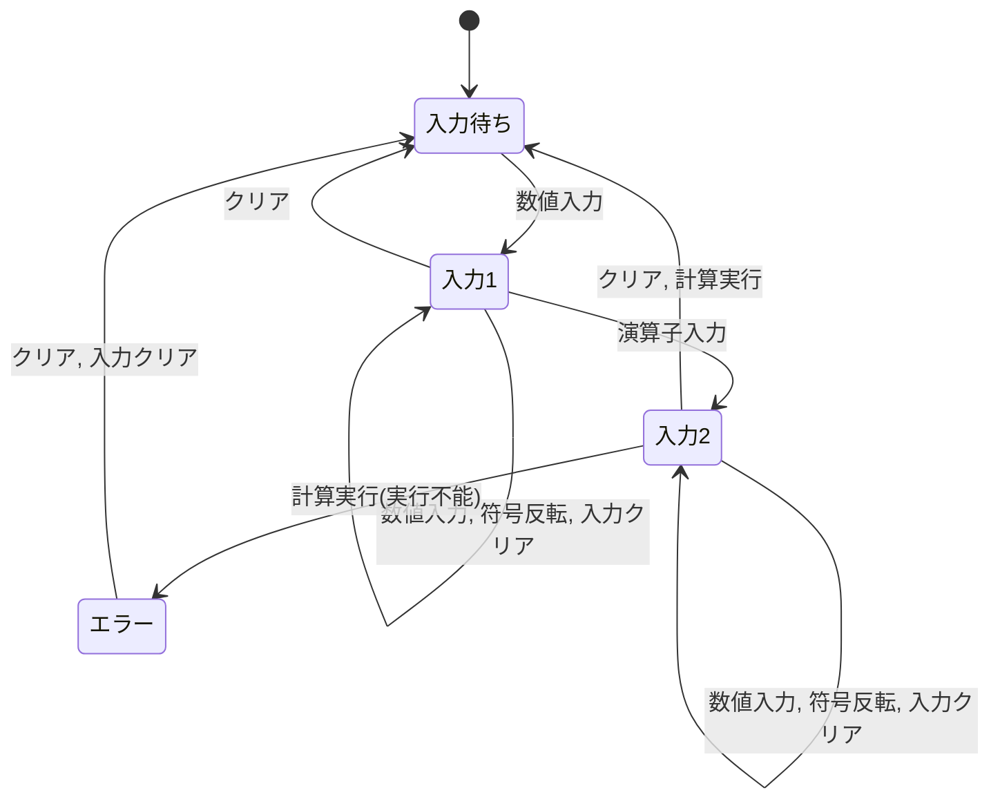

# 要件定義

演習用に作成した電卓Webアプリの簡易的な要件定義書

## 1. システム概要

2つの数値を入力し、四則演算やパーセント計算ができる電卓Webアプリを提供する。

### 1.1 システム名

電卓Webアプリ

### 1.2 目的

ユーザがブラウザ上で基本的な電卓機能を行えるWebアプリを提供する。

### 1.3 対象利用者

ブラウザ上で簡単な計算を行いたいユーザ

---

## 2. 画面

```text
+------------------------+
| 電卓Webアプリ           |
|        (式表示欄)  12 + |
+------------------------+
|           (入力欄)  0  |
+------------------------+
| CE | C  | ±  | %  | ÷  |
| 7  | 8  | 9  | x  | -  |
| 4  | 5  | 6  | +  | =  |
| 1  | 2  | 3  | 0  | .  |
+------------------------+
```

- 式表示欄: 入力された数値や演算子を表示する
- 入力欄: 現在入力中の数値や計算結果を表示する
- ボタン: 数字、演算子、クリア系の入力を受け付ける

## 3. 状態遷移

電卓上の状態遷移を定義する。



- 状態
    - 入力待ち: 数値入力を待っている状態
    - 入力1: 入力1を受け付けている状態
    - 入力2: 入力2を受け付けている状態
    - エラー: 計算不能な状態
- 行動
    - 数値入力: 数字ボタンや小数点の入力
    - 符号反転: ±ボタンの入力
    - 演算子入力: +, -, x, ÷ ボタンの入力
    - クリア: Cボタンの入力
    - 入力クリア: CEボタンの入力
    - 計算実行: =, % ボタンの入力

## 4. 機能要件

機能要件として、システムの機能・振る舞いを定義する。

|   No | 分類     | 機能名             | 要件内容                                                                                                                                                      | レビュー点 | 対応スプリント           |
| ---: | -------- | ------------------ | ------------------------------------------------------------------------------------------------------------------------------------------------------------- | ---------- | ------------------------ |
| F-01 | 入力     | 数字入力           | 数字ボタン（0〜9）押下時に、その値を入力欄に表示する。                                                                                                        |            | 対応済み                 |
| F-02 | 入力     | 小数点入力         | 「.」ボタン押下時に、入力欄へ小数点を追加する。                                                                                                               |            | 対応済み                 |
| F-03 | 入力     | 符号反転           | 「±」ボタン押下時に、入力欄の数値の符号を反転する。                                                                                                           |            | 対応済み                 |
| F-04 | 入力     | 式表示             | 入力2の状態で、入力1と演算子を式表示欄に表示する。 入力2以外の状態では何も表示しない。                                                                        |            | 対応済み                 |
| F-05 | 計算     | 計算実行           | 「=」ボタン押下時に、入力された式を計算し、入力欄に結果を表示する。                                                                                           |            | 対応済み                 |
| F-06 | 演算     | 加算               | 入力された2つの数値を加算する。                                                                                                                               |            | 対応済み                 |
| F-07 | 演算     | 減算               | 入力された2つの数値を減算する。                                                                                                                               |            | チュートリアルスプリント |
| F-08 | 演算     | 乗算               | 入力された2つの数値を乗算する。                                                                                                                               |            | 演習スプリント1          |
| F-09 | 演算     | 除算               | 入力された2つの数値を除算する。                                                                                                                               |            | 演習スプリント1          |
| F-10 | エラー   | エラー表示         | 0除算など計算不能な計算が実行された場合に、入力欄にエラーメッセージ(Error)を表示する。                                                                        |            | 演習スプリント1          |
| F-11 | 制限     | 表示桁数制限       | 最大12桁(整数部最大10桁、小数部最大8桁)まで入力を受け付ける。上限を超えた場合 、表示の値を維持する。                                                          |            | 演習スプリント2          |
| F-12 | 制限     | 計算結果桁数制限   | 計算結果が表示桁数を超えた場合に、エラーメッセージ(Overflow)を入力欄に表示する。                                                                              |            | 演習スプリント2          |
| F-13 | クリア   | クリア             | 「C」ボタン押下時に、入力1・入力2を含む入力中の計算式、計算結果、演算状態を初期化し、入力欄に `0` を表示する。                                                |            | 対応済み                 |
| F-14 | クリア   | 入力クリア         | 「CE」ボタン押下時に、現在入力中の値を `0` にリセットする。入力2の状態で押下した場合、入力1と演算子は保持する。                                               |            | 演習スプリント3          |
| F-15 | 特殊計算 | パーセント計算実行 | 「%」ボタン押下時に、入力1に対する入力2の割合を計算し、さらに式を計算して、入力欄に結果を表示する。 (例: 入力1, +, 入力2, % -> 入力1 + (入力1 × 入力2 ÷ 100)) |            | 演習スプリント4          |

---

## 5. 非機能要件

非機能要件として、機能以外でどのような品質・制約で動作するか定義する。
(演習用に抜粋)

|    No | 分類   | 要件内容                                                                   | レビュー点 | 対応スプリント  |
| ----: | ------ | -------------------------------------------------------------------------- | ---------- | --------------- |
| NF-01 | 性能   | ボタン押下後1秒以内に画面表示を更新する                                    |            | 対応済み        |
| NF-02 | 操作性 | 数字(青)・演算子(オレンジ)・クリア系ボタン(赤)が色分けされており識別できる |            | 演習スプリント5 |
| NF-03 | 可用性 | ページ再読み込み後に入力待ちの状態で操作を開始できる                       |            | 対応済み        |
